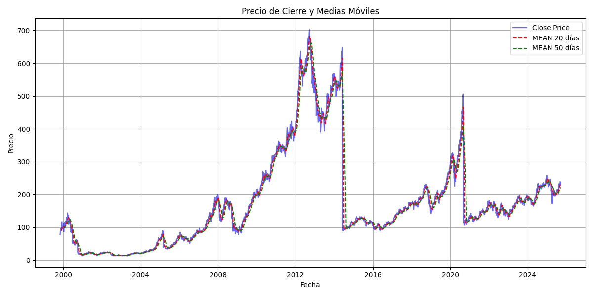

# 📈 Financial ETL Pipeline

Este proyecto implementa un **pipeline ETL (Extract, Transform, Load)** para la descarga, procesamiento y visualización de datos financieros de la acción **Apple (AAPL)**.  

El flujo principal:
1. **Extract** → Descarga datos diarios desde la API de Alpha Vantage.  
2. **Transform** → Limpieza, cálculo de medias móviles (20 y 50 días) y almacenamiento en CSV.  
3. **Load** → Genera visualizaciones del precio de cierre y medias móviles.  

---

## 🚀 Estructura del proyecto

```
financial-etl/
├── data/
│   ├── raw/                # Datos crudos descargados
│   └── processed/          # Datos procesados listos para análisis
│       └── AAPL_daily.csv
├── outputs/
│   └── closing_price_chart.png   # Gráfica generada
├── etl_pipeline.py         # Script principal ETL
├── requirements.txt        # Dependencias del proyecto
├── .env                    # API keys (no subir a GitHub)
└── .gitignore              # Archivos a ignorar
```

---

## 📦 Instalación

Clona el repositorio y crea un entorno virtual:

```bash
git clone https://github.com/enriquerompin/financial-etl.git
cd financial-etl
python -m venv .venv
source .venv/bin/activate   # en Mac/Linux
.venv\Scripts\activate      # en Windows
pip install -r requirements.txt
```

---

## 🔑 Configuración

Crea un archivo `.env` en la raíz con tu API key de [Alpha Vantage](https://www.alphavantage.co/):

```
ALPHA_VANTAGE_API_KEY=tu_api_key
```

---

## ▶️ Uso

Ejecuta el pipeline con:

```bash
python etl_pipeline.py
```

Esto generará:
- Un CSV procesado en `data/processed/AAPL_daily.csv`  
- Una gráfica de precios y medias móviles en `outputs/closing_price_chart.png`  

Ejemplo de salida:  



---
